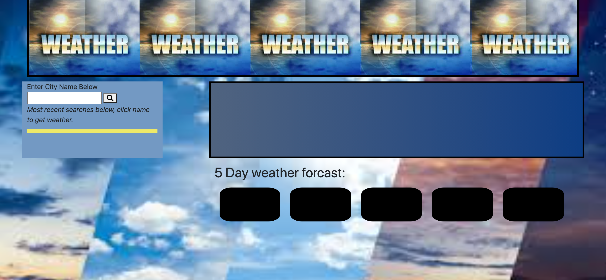
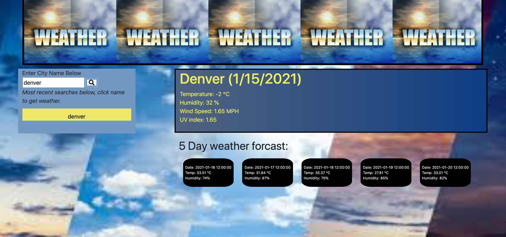
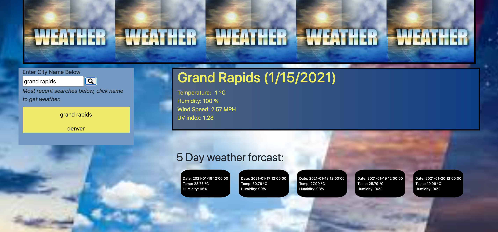
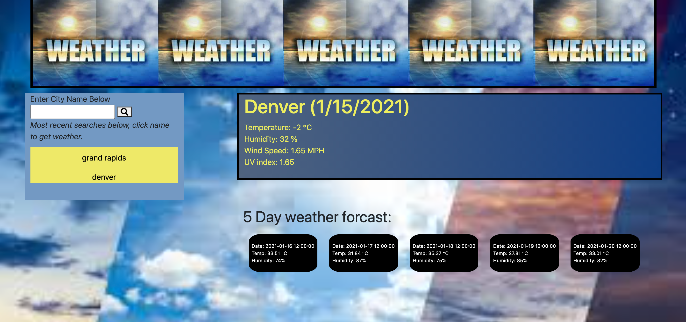

# Weather_service
This is a web application that informs the user of the weather in the area that they are interested in.  The weather application is supported by jquery, bootstrap and open weather map api.  A discription of how to use the online application is as follows.

As can be seen above, the image of the initial page with no searches performed.  The page has a search bar with some open div areas at which will be populated once a search is completed.

The first search that was performed was for Denver Colorado.  There is no necesitation for capitalization.  Once the search button is pressed, the area directly adjacent to the search bar will be occupied with the current date and weather information.  As can be seen in the picture above.  Directly below that box there is a five day forcast that is populated as well.

A second search is performed to show that the searches can be performed sequentially on the same page without refreshing.  Underneith the search bar the area is populated with most recent searches.  These searches are saved on the browser so that the information can be acessed when the user comes back to the site.

Furthermore, the above image shows how the city populated area under the search bar has active names at which can be pressed and accessed to show the weather from those areas.

Root Menu:
- images folder
- assets folder
- READ ME

Images folder:

Assets folder:
- index.html
- style.css
- script.js

This site is powered by:
- JQuery
- Bootstrap
- Font Awesome
- Open Weather Maps API
